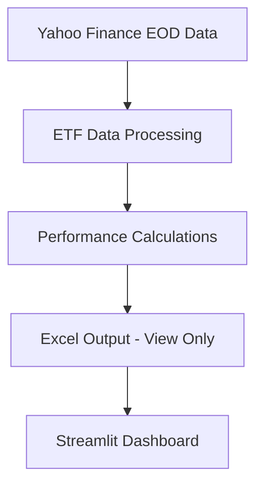

# ETF Analytics Dashboard - Documentation Guide 🟢

## ⚠️ Required Checklist Before Any Changes
1. **Environment Rules**
   - Use my_quant_env (via .bat files only, NO conda)
   - Review documentation first
   - Protected code needs explicit permission

2. **File Verification**
   - Check current working files in run_dashboard.bat
   - Verify DO NOT CHANGE sections
   - Note any WORKING ONLY markers

3. **Change Protocol**
   - List proposed changes
   - Wait for approval
   - No timestamps/timezones unless requested
   - Document any failed approaches

❗ This checklist must be reviewed every 3 responses or before any changes

## 🗺️ Quick Navigation Guide

### 1️⃣ Project Overview & Flow
Start here to understand the system:
- **What**: ETF analytics system with Excel output and Streamlit visualization
- **Where**: Latest working code at `S:\Dropbox\Scott Only Internal\Quant_Python_24\XLSX_metrics_Streamlit_121324`
- **Backup**: `S:\Dropbox\Scott Only Internal\Quant_Python_24\XLSX_metrics_Streamlit_Backup_121424`

### 2️⃣ Key Documentation Paths

#### For Understanding the System:
1. **Project Flow** → [core/01_SYSTEM_FLOW.md](./core/01_SYSTEM_FLOW.md)
   - How data moves through the system
   - Key processing steps
   - Integration points

2. **Dashboard & Output** → [features/02_USER_INTERFACE.md](./features/02_USER_INTERFACE.md)
   - What you see and interact with
   - Where to find outputs
   - How to use the interface

3. **Calculations & Logic** → [core/03_METRICS_LOGIC.md](./core/03_METRICS_LOGIC.md)
   - What's being calculated
   - How metrics are processed
   - Excel output format

#### For Development & Maintenance:
- **Setup** → [setup/INSTALLATION.md](./setup/INSTALLATION.md)
  - Environment setup (my_quant_env)
  - Dependencies
  - Configuration

- **Current State** → [maintenance/WORKING_STATE.md](./maintenance/WORKING_STATE.md)
  - What's working
  - Recent changes
  - Known good state

## 🔄 Data & Process Flow

### Usage Characteristics
- **Analysis Volume**: 3-10 analyses per day
- **Ticker Range**: 1-20 tickers per analysis
- **Data Type**: End-of-day prices only (datetime.date objects)
- **Excel Output**: View-only files, no manual modifications
- **Access Pattern**: Dashboard-based viewing only
- **Date Handling**: All dates stored as datetime.date objects for consistency



### Critical Implementation Notes
- All date indexes must be datetime.date objects (not datetime or Timestamp)
- Dividend data requires 'Amount' column cleanup before processing
- Multi-ticker processing requires consistent date formats across all operations

## 📁 File Structure Quick Guide
- `/src/data/` - Data fetching & processing
- `/src/models/` - Core calculations
- `/streamlit_app/` - Dashboard interface
- `/test_output/` - Generated Excel files

## ⚡ Quick Status (2024-12-15)
- All core functionality working
- Environment: my_quant_env (required)
- Dashboard: Fully functional
- Data Flow: Complete pipeline operational

## 🎯 Core Features Status
### Data Layer 🟢
- Yahoo Finance data download ✓
- ETF data management ✓
- Excel operations ✓

### Model Layer 🟢
- Performance metrics calculations ✓
- Metrics writing to Excel ✓

### Streamlit Layer 🟢
- Metrics display ✓
- Excel data reading ✓
- Dashboard visualization ✓

## 🔍 Common Tasks Guide

### 1. Running the Dashboard
```bash
my_quant_env\Scripts\activate
streamlit run streamlit_app/dashboard_xlsx_viewer.py
```

### 2. Monitoring Calculations
```bash
# Check logs for:
- BIL calculation status
- Metrics calculation flow
- Fallback scenarios
```

### 3. Finding Output Files
Excel files are in: `test_output/` directory
- Format: Date_Tickers_Metrics.xlsx
- Contains: Price data, dividends, calculations

### 4. Checking System Health
1. Review [maintenance/WORKING_STATE.md](./maintenance/WORKING_STATE.md)
2. Verify dashboard loads
3. Check Excel output generation

## 🚨 Need Help?
1. Check [troubleshooting/KNOWN_ISSUES.md](./troubleshooting/KNOWN_ISSUES.md)
2. Verify environment (my_quant_env)
3. Check latest backup

## Sharpe Ratio Calculation

The Sharpe ratio is calculated using historical risk-free rates from the 13-week Treasury Bill (^IRX). This provides a more accurate measure of risk-adjusted returns compared to using a fixed rate.

### Implementation Details

1. **Risk-Free Rate Source**
   - Data: ^IRX (13-week Treasury Bill)
   - Source: Yahoo Finance
   - Frequency: Daily rates
   - Processing: Forward-fill and backward-fill for missing values

2. **Calculation Formula**
   ```python
   sharpe_ratio = (excess_returns.mean() * 252) / (returns.std() * np.sqrt(252))
   ```
   where:
   - `excess_returns = daily_returns - daily_risk_free_rate`
   - `daily_risk_free_rate = annual_rate / 252`
   - Returns are annualized using √252 factor

3. **Interpretation**
   - Positive values indicate returns above risk-free rate
   - Negative values indicate returns below risk-free rate
   - Example ranges:
     * Low-volatility instruments (e.g., SHV): -0.2 to 0.2
     * Market benchmarks (e.g., SPY): 0.5 to 2.0
     * Volatile assets: Can exceed ±2.0

4. **Important Notes**
   - Values are written to Excel with 2 decimal precision
   - No additional scaling is applied
   - Historical rates are used throughout the calculation period
   - Extreme values (|SR| > 3) should be investigated

### Validation Checks

1. **Data Quality**
   - Treasury rates must be available for calculation period
   - Returns data must be properly aligned with rates
   - Missing data is handled via forward/backward fill

2. **Calculation Checks**
   - Excess returns should be small for Treasury-like instruments
   - Standard deviation should reflect instrument volatility
   - Final Sharpe values should be within expected ranges

3. **Common Issues**
   - Missing rate data can affect calculations
   - Look-ahead bias if using future rates
   - Scaling errors in rate conversion

### Example Values

Typical Sharpe ratios for different asset types:

1. **Short-term Treasuries (e.g., SHV)**
   - Expected range: -0.2 to 0.2
   - Current value: -0.13

2. **Market Index (e.g., SPY)**
   - Expected range: 0.5 to 2.0
   - Current value: 1.57

3. **Long-term Bonds (e.g., TLT)**
   - Expected range: -1.0 to 1.0
   - Current value: -0.53

### Code Implementation

```python
def calculate_sharpe_ratio(returns, risk_free_rates):
    """
    Calculate Sharpe ratio using historical risk-free rates.
    
    Args:
        returns (pd.Series): Daily returns
        risk_free_rates (pd.Series): Daily risk-free rates (annual rates / 252)
        
    Returns:
        float: Annualized Sharpe ratio
    """
    excess_returns = returns - risk_free_rates
    if len(excess_returns) < 2:
        return 0.0
        
    annualized_excess_return = excess_returns.mean() * 252
    annualized_volatility = returns.std() * np.sqrt(252)
    
    if annualized_volatility == 0:
        return 0.0
        
    return annualized_excess_return / annualized_volatility
```

### Troubleshooting

1. **Extreme Values**
   - Check rate alignment
   - Verify return calculations
   - Confirm volatility is non-zero

2. **Missing Data**
   - Check rate availability
   - Verify forward/backward fill
   - Ensure sufficient data points

3. **Inconsistent Results**
   - Compare with benchmark calculations
   - Verify rate conversion
   - Check annualization factors

## 🔄 Latest Updates (2024-12-15)
### BIL Risk-Free Rate Implementation 🟢
- Calculates risk-free rate using BIL ETF data
- Uses 2-year historical price and dividend data
- Fallback to 3% default rate with logging
- Status: Fully operational

### Metrics Calculation Updates 🟢
- Removed unauthorized Default_Rate column
- Enhanced logging throughout calculation process
- Debug prints added for troubleshooting
- Status: Verified working

### System Improvements 🟢
- Added comprehensive logging system
- Enhanced error tracking
- Backup created at: XLSX_metrics_SharpeBIL Strlit_121324
- All core functionality maintained

## 📝 Troubleshooting Guide
- Check debug prints in console
- Verify BIL data availability
- Confirm metrics sheet creation
- Review logs for fallback cases
